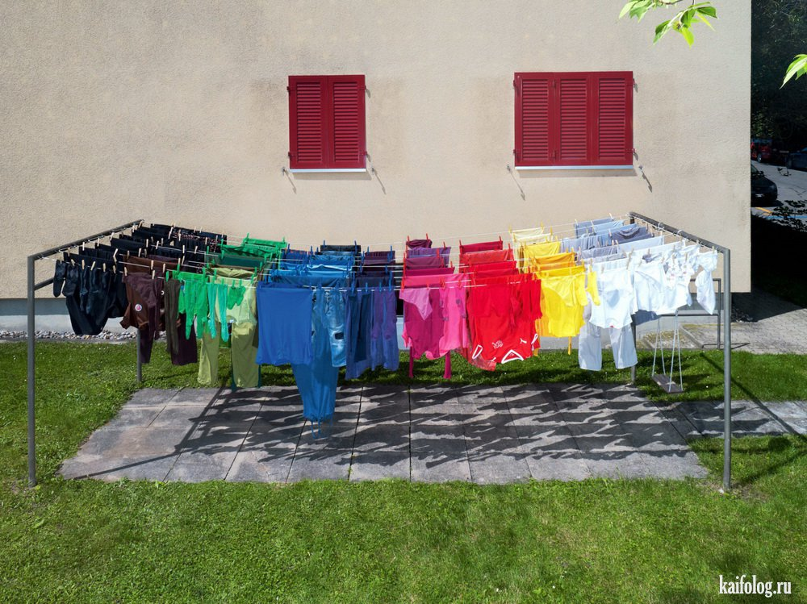

---

layout: sc5

style: |

    #Cover .main-logo__wrapper {
        width: 100%;
        text-align: center;
    }
    #Cover object.main-logo {
        z-index: 5;
        position: static;
        width: 200px;
        margin: 35px 50px;
    }

    #Cover h2 {
        margin:30px 0 0;
        color:#FFF;
        text-align:center;
        font-size:70px;
        }
    #Cover p {
        margin:10px 0 0;
        text-align:center;
        color:#FFF;
        font-style:italic;
        font-size:20px;
        }
        #Cover p a {
            color:#FFF;
            }
    #Picture h2 {
        color:#FFF;
        }
    #SeeMore h2 {
        font-size:100px
        }
    #SeeMore img {
        width:0.72em;
        height:0.72em;
        }
---

# Driving <nobr>Style-Guide-Driven</nobr> Development {#Cover}

*Brought to you by [Varya Stepanova](http://varya.me/) and generated by [Jekyller](https://github.com/shower/jekyller)*

    <object class="main-logo" data="themes/sc5/images/logo.min.svg#white" type="image/svg+xml"></object>

## Varya Stepanova
{: .varya }

Frontend developer at [SC5 Online](http://sc5.io), Helsinki 
Long-running projects, UI libraries, **style-guide-driven development** 
[@varya_en](https://twitter.com/varya_en)

## The art of cleaning up
{: .cover .systematic }

<!--
About keeping things in order.
About programming lazyness.
About not driving a stick.
About robots should work and people should not.
About organizing things for a better life.
About fly lady.
-->

## Component-based approach
{: .shout }
<!-- TODO: change the title -->

## Old school way
{: .cycle }

mockup

markup

product

<!--How it used to be-->

## Dash process
{: .dash-process }

### In your dreams

mockup

markup

integration

### In reality

mockup

markup

  
mockup

  
markup

 
...over and over again

<!-- TODO: Better colors -->

## Old school way

* Inconsistent visual system
* Inconsistent code (duplicant, unreasoned)
* Version confusion
* Time-consuming
* <b>Unmaintainable</b>

<!-- time conhard to edit/change/keep up-to-date)-->

## Websites are systems
{: .anna}

<!-- What we are actually developing -->
> Websites are systems rather than pages and as soon as we
> stop percerving them as that, the better.
<figcaption>Anna Debenham</figcaption>

## Modular CSS architecture

* OOCSS
* SMACSS
* BEM
* Atomic design

or any other modular solution
{: .note }

## Modular CSS architecture

<!-- TODO: Draw component development cycles -->

## Living Styleguides

A <b>living styleguide</b> represents UI components of your website with exact the same styles
which you use across the project.

## Styleguide Driven Development

Styleguide <s>can</s> must be an integral part of your development workflow.

<b>Styleguide Driven Development</b> is the practise of using the styleguide as the focal point for all front-end UI
development tasks.

## Getting out of your comfort zone
{: .challenge }

## The tool we missed
{: .tool }

[http://styleguide.sc5.io](http://styleguide.sc5.io)

## Easy to start

* `npm install sc5-styleguide`
* CSS / SCSS / SASS / LESS
* Documentation in code, KSS-compatible
* Gulp- / Grunt- integrated

## Easy to keep up to date

* Living styleguide
* Documenttaion in code
* Supports angular directives

## Use as development playgroud

* Related variables and styles
* Variable-component mapping
* Live editting
* Watching and auto-refreshing

## Bridges the gap

* design/developer communication
* cross-team communication
* communication for remote teams

## Development with Styleguide Generator by SC5

* Living overview of UI
* Quick manual testing
* Quick built-out of new pages
* Unit tests for UI
* Device-wall friendly
* <b>Easier designer/developer/client collaboration</b>

## Developers mindset
{: .mindset }

###Before

What markup, CSS and JS I need?

### After
What modules is this page made of? Do I need to create new modules? **Future modules and pages start in styleguide**.

## Thank you!
{: .thanks }

Varya Stepanova, SC5 Online

### Questions?

